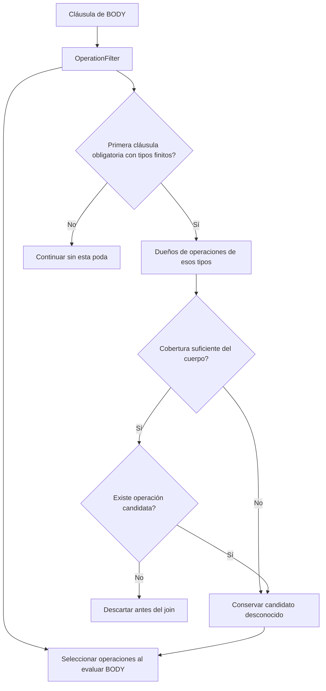
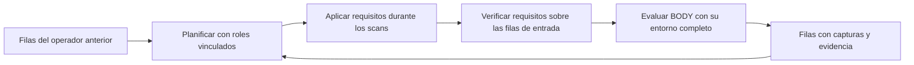
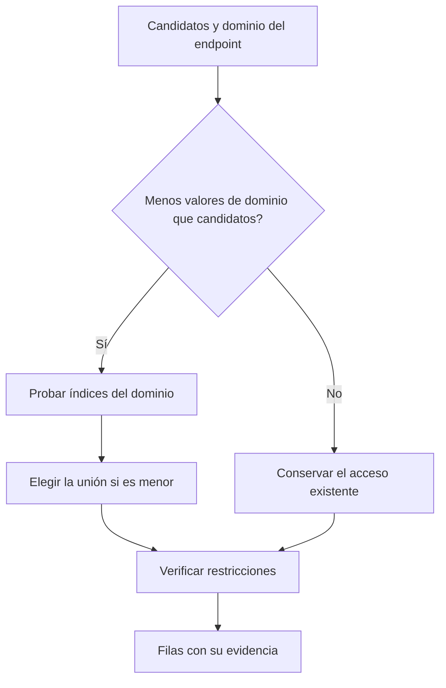

# Requisitos de BODY antes de los joins

Esta ronda parte de los accesos selectivos de la ronda anterior. Ataca dos costes
distintos: combinar declaraciones cuyo cuerpo no puede satisfacer la consulta,
y explorar un dominio de índices que cuesta más que verificar los candidatos ya
disponibles.

## Un contrato compartido con el evaluador

`body_operations.operation_filter(clause)` describe qué operaciones puede
examinar una cláusula. El evaluador usa ese contrato para recorrer el cuerpo y
el planificador lo usa como condición necesaria antes de construir los joins.
Los tipos de operación tienen una sola definición.

El índice nativo resuelve el inventario de dueños directamente sobre columnas
SQLite. No necesita reconstruir objetos de operación ni leer sus atributos. El
inventario pertenece a la revisión inmutable del grafo y se libera al cerrar el
índice. El backend en memoria obtiene el mismo conjunto de sus operaciones.

Hay dos límites semánticos explícitos. Una llamada indexada puede acreditarse
bajo otro tipo sintáctico; esa forma no permite esta poda por tipo. Un retorno
de una función con cuerpo de expresión puede acreditarse mediante `BODY_VALUE`
sin una operación `RETURN`; esos dueños también permanecen como candidatos.

## Replanificar con los roles disponibles

El planificador recibe los roles que la fila ya tiene vinculados. Así puede
usar requisitos de un segundo BODY aunque su declaración se haya seleccionado
antes del primero. La ausencia de evidencia sólo descarta un dueño cuya
cobertura se conoce; un valor desconocido sigue llegando al evaluador.

Los requisitos se aplican a la entrada de BODY y se descartan antes de evaluar
sus salidas. Esto permite filtrar incluso cuando no hay otro scan entre dos
cuerpos, sin confundir capturas nuevas con las entradas anteriores.

## Elegir el acceso por su trabajo mínimo

Para restringir un endpoint, el motor puede consultar un índice por cada miembro
del dominio o verificar las filas del acceso que ya eligió. Son alternativas de
acceso a la misma conjunción.

Antes se consultaban muchos índices vacíos buscando una unión menor. Cuando el
acceso existente contiene dos filas y el dominio contiene mil valores, sólo
iniciar esas mil búsquedas cuesta más que verificar las dos filas. Ahora tanto
el estimador como el ejecutor evitan esa alternativa cuando el número de
búsquedas alcanza o supera el número de candidatos. Las restricciones
originales siguen verificándose.

El estimador conserva la selectividad contando la intersección sobre el conjunto
menor. Se probó usar sólo el tamaño del acceso existente como cota, pero esa
aproximación empeoraba el orden de joins de Singleton en el corpus pequeño.
Contar sus pocos candidatos evita tanto las búsquedas costosas como esa pérdida
de precisión.

## Validación y límites

**13.272 pruebas pasan y 10 tienen fallo esperado**. Se añadieron 70 pruebas.
Las pruebas comparan resultados, evidencia e incertidumbre con el ejecutor de
referencia, en memoria, SQLite y el índice vectorial. Cubren cobertura completa,
parcial y ausente, cuerpos suspendidos, dueños ya vinculados y desconocidos,
inventarios de revisiones distintas y búsquedas que no decodifican operaciones.

Un caso con cuarenta declaraciones ajenas reduce de más de 1.600 a cuarenta las
filas que llegan a BODY y conserva los cuarenta resultados. Otra prueba cuenta
accesos al índice para que aumentar un dominio de uno a mil valores no encarezca
un join que ya dispone de dos candidatos.

Los resultados medidos se archivan en
`docs/structural-validation/kql2-body-prerequisites-2026-09-21/`.

Quedan productos cartesianos exigidos por las consultas actuales. Por ejemplo,
`iterator.variants.callback_iterator` declara un `$branch` independiente de las
cuatro alternativas del cuerpo. En el diagnóstico inicial eso multiplica 740
filas por 743 operaciones y materializa 549.820 combinaciones. Cambiar la
consulta modificaría su significado; una futura ejecución factorizada tendrá
que conservar los bindings y los grupos de evidencia de esa proyección.

## Resultados finales

| Consulta completa | Antes | Después |
|---|---:|---:|
| Observer / 100 archivos | 119,869 s | 15,248 s |
| Iterator / 100 archivos | 16,198 s | 10,408 s |
| Strategy / 100 archivos | 5,343 s | 5,167 s |
| 23 GoF / 26 archivos | 5,264 s | 4,994 s |

Se informa la segunda ejecución de cada proceso. Las dos muestras de las cuatro
consultas terminan completas; los hashes de resultados, evidencia e
incertidumbre coinciden entre versiones y repeticiones. El SDK tiene dos
hallazgos e Iterator tres; Strategy y Observer no tienen hallazgos positivos en
este corpus. La suite diferencial también cubre fixtures positivos.

Observer resulta 7,86 veces más rápido e Iterator reduce su tiempo un 35,7 %.
Estas mejoras corresponden a consultas completas, sin caché de resultados.

El gate de los 23 GoF sobre 100 archivos **sigue sin pasar**: 65,380 s y nueve
patrones incompletos antes; 63,438 s y ocho después. Strategy pasa a completar
dentro de su presupuesto individual en el lote. Siguen incompletos Builder,
Command, Iterator, Mediator, Memento, Observer, Singleton y Template Method.
Las catorce consultas completas en ambas versiones conservan resultados e
incertidumbre. El objetivo exige el lote completo por debajo de 5 s, no sólo
cada consulta por separado; estos tiempos parciales no satisfacen ese objetivo.
