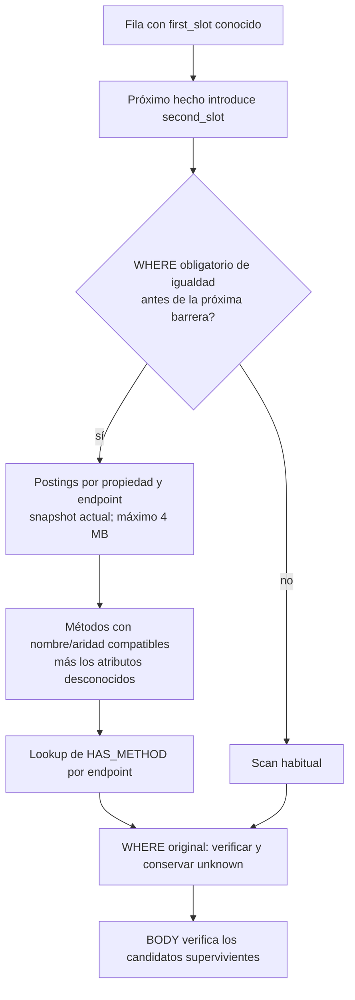
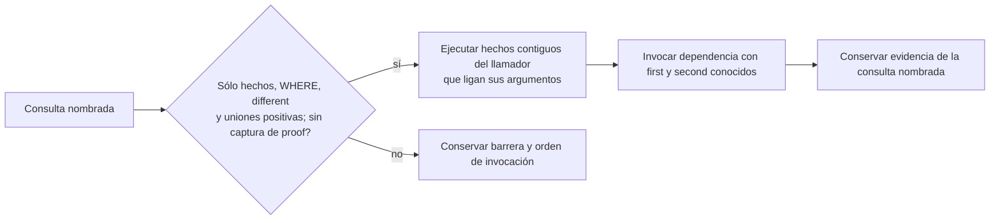
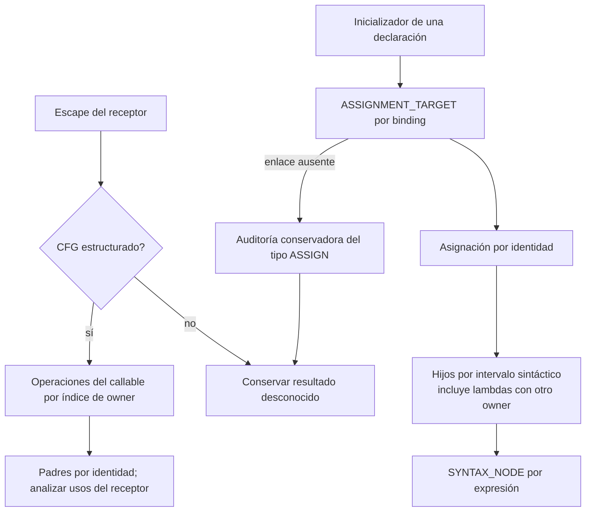

# KQL2: segunda ronda de optimización de joins

El objetivo sigue siendo ejecutar los 23 patrones GoF sobre los 100 archivos del
manifiesto fijado, con índice preparado, en menos de 5 segundos. **Todavía no se
cumple.** Los tiempos de patrones individuales no sustituyen el gate completo.

## Comparar propiedades antes de expandir las filas

El perfil de Abstract Factory mostró 5.135 filas entrando a un scan independiente
de `HAS_METHOD`. Cada una enumeraba los 280 métodos antes de comparar nombre y
aridad: 1.437.800 combinaciones potenciales. El diagnóstico anterior alcanzó
1.226.400 filas materializadas antes de agotar su presupuesto.

El scan problemático produce ahora 8.786 candidatos. Las propiedades se leen con
la misma resolución que `Executor.operand`, incluido el fallback de ENTITY y
OPERATION. La igualdad literal de KQL2 y las alternativas de KQL1 mantienen su
dirección y sus reglas para booleanos. Un atributo ausente nunca prueba rechazo.

El índice temporal sólo se construye para relaciones de hasta 10.000 hechos y
comparte el límite de 4 MB por lote/snapshot. No guarda hallazgos de patrones.
Los filtros no atraviesan ANY general, BODY, COUNT, NOT, OPTIONAL ni dependencias.
Los perfiles exponen sus expresiones en `property_prefilter`.

## Correlacionar dependencias que son relaciones positivas

Facade declaraba primero `use Subsystems(first, second)`. Esa dependencia
enumeraba pares de métodos o funciones de subsistemas distintos; después el
llamador buscaba llamadas que efectivamente usaran ese par.

Esto conserva la llamada como una operación con su propia evidencia. No se
expanden ni reordenan dependencias con BODY: sembrar un output de BODY puede
cambiar lo que significa una captura incierta. Tampoco se atraviesan agregados,
ausencia, consultas con captura de prueba u operadores de fuente desconocidos.

## Leer sólo las operaciones necesarias

Los analizadores de escape e inicializadores ya no construyen dos inventarios
completos de operaciones antes de trabajar. Los inicializadores conservan la
auditoría de asignaciones cuando falta el enlace al binding. Las vistas de BODY
evitan además una segunda lectura de un nodo si sus atributos ya contienen owner.

Los buckets de hechos filtrados se identifican por sus restricciones, endpoints
y revisión, independientemente del nombre de la variable de la consulta. Esto
permite compartir una selección entre `$initialize` y `$configure` sin compartir
sus bindings o resultados.

## Mediciones y límites

En la comparación A/B sin perfilador ni caché de resultados, la segunda ejecución
completa de Abstract Factory sobre los 100 archivos pasó de **13,253 s a 1,694 s**
(7,8 veces). La primera ejecución con índice preparado fue 18,390 s frente a
6,266 s: preparar el índice no equivale a calentar todas las rutas del proceso.
La huella de hallazgos, evidencia, completitud e incertidumbre fue idéntica.

El lote completo de los 26 archivos TypeScript pasó de **8,265 s a 6,760 s** en
la segunda ejecución. Las huellas también coinciden al normalizar exclusivamente
la ruta de instalación del catálogo copiado para el baseline. Las rutas del código
analizado y la evidencia no se eliminan de la comparación.

Estos valores se obtuvieron antes del último cambio de lectura de inicializadores.
El gate final y los artefactos se conservan en el
[registro de esta ronda](../../structural-validation/kql2-latency-2026-09-20/round-2/README.md).

Siguen pendientes los productos previos a COUNT y los dominios de BODY que
multiplican métodos, campos, parámetros y capturas. El perfil muestra costes
altos en Interpreter, Memento, Command, Mediator y Template Method. Reducir esas
combinaciones requiere preservar la incertidumbre y el cierre de relaciones:
descartar los candidatos desconocidos no sería una optimización válida.
