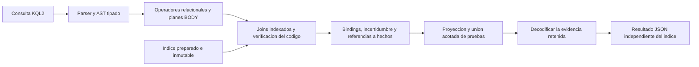
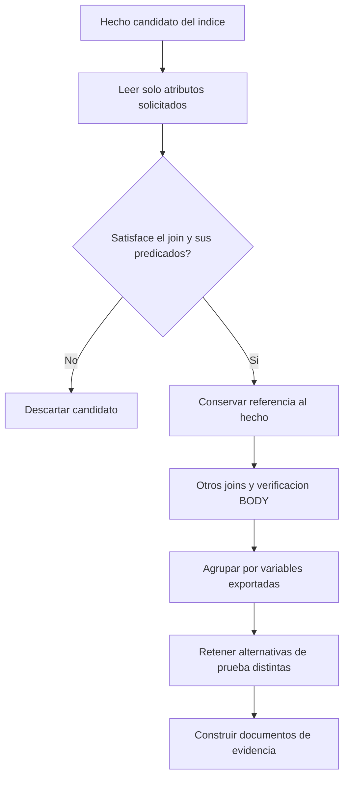
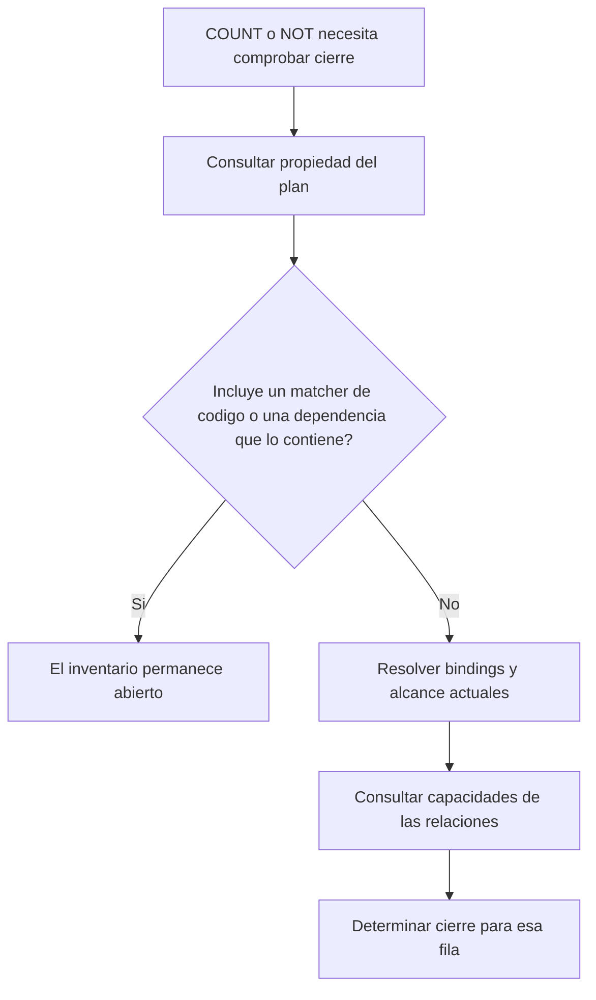

# KQL2: construir la evidencia al final

La mejora separa **encontrar una coincidencia** de **construir su prueba**.
Se aplica a KQL1 y KQL2 mediante el ejecutor relacional compartido, sin reglas
especiales por patrón del catálogo o lenguaje fuente.

El objetivo global sigue pendiente: el lote de 100 archivos tarda **66,958 s**
y deja 9 patrones incompletos. Las comparaciones completas de esta ronda mejoran
Interpreter de **11,416 a 3,356 s** y los 23 GoF sobre 26 archivos de **7,124 a
6,094 s**, conservando resultados, evidencia e incertidumbre.

## Parsear, buscar y explicar

En `ae82f39`, `Executor.facts` leía los atributos completos y la evidencia de
cada hecho al construir filas intermedias. Un vector nativo puede producir
nuevos objetos al recorrerlo nuevamente: diferir la lectura en cada objeto no
impedía decodificar los mismos documentos muchas veces en joins correlacionados.

Ahora `Fact.attribute(key)` lee solamente el miembro solicitado. El lector nativo
lo obtiene del diccionario codificado o de las columnas de operaciones sin
expandir los demás atributos. `.attrs` sigue devolviendo documentos mutables
independientes; las lecturas respetan cambios en un registro ya materializado.

La evidencia intermedia contiene referencias `FactEvidence`, que conservan
sujeto, relación, objeto e identidad de la fuente. El resultado público y las
capturas explícitas de pruebas las materializan mientras el índice está abierto.
Estas lecturas diferidas siguen sujetas al presupuesto y la cancelación.

## La evidencia sigue a los resultados que sobreviven

`ProofAccumulator` mantiene incrementalmente el límite existente de 16 pruebas
distintas por binding proyectado. Las pruebas ciertas preceden a las inciertas,
conservando el orden original dentro de cada grupo. Una prueba cierta que llega
tarde puede desplazar una incierta aun después de truncar. El límite acota la
evidencia: la búsqueda continúa y puede mejorar la certeza del resultado.

Antes, cada nuevo testigo reconstruía y deduplicaba el grupo completo. Ahora
sólo se comparan los testigos nuevos. Cuando un grupo lleno ya está marcado como
truncado, un testigo de menor prioridad no puede modificarlo: tampoco hace falta
leer su fuente.

## Parte del cierre del inventario depende del plan

Los matchers de código informan cobertura por testigo, no un inventario cerrado.
Detectar que el plan contiene uno no requiere consultar capacidades por cada
fila externa. El análisis iterativo del plan se conserva dentro del ejecutor y
se libera en `close()`. Los planes puramente relacionales mantienen sus
comprobaciones dinámicas de bindings, parámetros de consultas y alcance.

La batería amplia también detectó un error anterior: adelantar un join a través
de un `MATCH` con exportaciones omitidas movía ese hecho al interior del grupo de
pruebas alternativas. Las proyecciones parciales ahora son fronteras semánticas.
La correlación existente sigue disponible cuando se suministran todas las
exportaciones públicas.

## Experimento descartado

Se probó reducir dominios mediante semijoins. Disminuía algunas combinaciones
intermedias de Builder, pero dejaba el producto cartesiano dominante y el coste
de BODY. Su preparación y estado adicional no justificaban incorporarlo.
La implementación final concentra la mejora en la representación de datos y
pruebas, sin agregar otro planificador.

## Mediciones completas A/B

Ambos runtimes usaron los mismos TOML e inputs, un índice nativo preparado y
caché de resultados desactivada. Las búsquedas fueron secuenciales, sin pytest
en paralelo. Cada proceso realizó dos búsquedas; la tabla compara la segunda.
La preparación del índice quedó fuera del temporizador; la evidencia final
está incluida.

| Búsqueda | Base `ae82f39` | Nueva ejecución | Aceleración |
|---|---:|---:|---:|
| Interpreter, corpus fijo de 100 archivos | 11,416 s | 3,356 s | 3,40× |
| Los 23 GoF, 26 archivos del SDK | 7,124 s | 6,094 s | 1,17× |

Las cuatro búsquedas completaron. Hallazgos, evidencia e incertidumbre tienen
el mismo hash normalizado en cada par. Sólo se normalizan hashes de compilación,
la ruta temporal del catálogo y el orden de listas de diccionarios: se conserva
el contenido de las pruebas. Interpreter examina los mismos 307.588 hechos;
la mejora proviene de representarlos y explicar sus resultados con menos trabajo.

El gate global **no aprueba**: calentamiento de 71,764 s y medición de 66,958 s,
con 9 timeouts. Estos tiempos parciales no son la latencia de un escaneo completo
ni demuestran una mejora global frente a otro lote incompleto. El objetivo sigue
siendo los 23 patrones completos sobre los mismos 100 archivos en menos de 5 s.

Las respuestas originales, hashes y tiempos están en
[los artefactos de la ronda 3](../../structural-validation/kql2-latency-2026-09-20/round-3/README.md).

## Verificación

La ejecución final de `tests/kql2` y `tests/structural` termina con **13.170 pruebas
aprobadas y 10 xfail esperados**. Mypy no encuentra errores en los siete módulos
auxiliares comprobados. El runtime validado coincide con los hashes del medido.

Las pruebas diferenciales contrastan la unión incremental con el algoritmo
anterior: duplicados, grupos, truncamiento y certeza tardía. Las pruebas del
índice nativo comprueban lectura selectiva de atributos, columnas de operaciones,
sólo 16 fuentes decodificadas para 200 testigos proyectados, capturas JSON,
cancelación durante materialización y resultados utilizables después de cerrar
el índice. También se verifica la liberación del ejecutor sin recolección cíclica.
