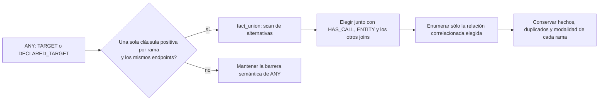
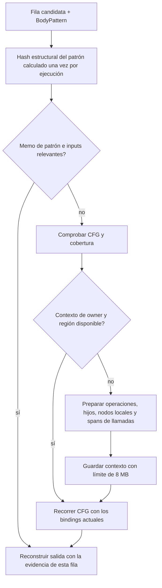
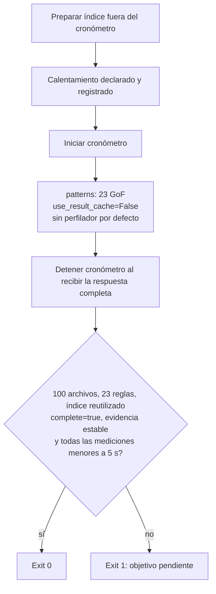

# KQL2: objetivo de 100 archivos en menos de 5 segundos

Contrato confirmado el 20 de septiembre de 2026: **búsqueda con índice preparado**.
La muestra fijada contiene 100 archivos reales de los SDK Python y TypeScript de
Codex: 963.991 bytes, 29.423 líneas, 39.727 entidades y 837.018 hechos. Se ejecutan
los 23 patrones GoF. La preparación inicial queda fuera de la medición; cargar el
índice, comprobar archivos, compilar consultas y producir evidencias quedan dentro.

**El objetivo aún no está cumplido.** La prueba de aceptación está implementada y
debe permanecer en rojo hasta que el lote completo termine en menos de 5 segundos.
Un timeout o un resultado incompleto nunca cuentan como un escaneo aprobado.

La [segunda ronda](join-optimization-2026-09-20.md) añade joins por propiedades,
dependencias positivas correlacionadas y lecturas locales de operaciones; incluye
nuevos diagramas y una comparación A/B. El objetivo global continúa pendiente.

El [informe anterior](performance-audit-2026-09-20.md) conserva siete diagramas del
estado previo y las mediciones originales. Este documento describe los cambios
posteriores, las alternativas descartadas y el criterio de aceptación.

## Cambios incorporados

### Planificar alternativas de hechos como un join



Antes, una alternativa de destino detenía el planificador aunque sus ramas fueran
dos hechos positivos equivalentes en sus bindings. Eso impedía considerar juntos
el dueño de una llamada, sus destinos y los dominios de los selectores. La nueva
operación es interna; no modifica la sintaxis ni los artefactos compilados.

También se demora un dominio independiente delante de una unión positiva cuando
sus dependencias pueden demostrarse. El caso observado en Iterator multiplicaba
el trabajo de BODY por cada operación `$branch`, aunque esa rama no intervenía en
BODY. Se conserva el producto y la evidencia final, evaluando primero la unión.
NOT, COUNT y OPTIONAL siguen siendo barreras. La segunda ronda añade una
excepción demostrable para consultas nombradas que sólo contienen relaciones
positivas; las demás consultas mantienen su barrera.

### Reutilizar la preparación de BODY



El hash se guarda en un wrapper de ejecución para no alterar el esquema del
codec de `BodyPattern`. Se mantiene la igualdad estructural entre patrones
distintos pero equivalentes.

Los contextos de owner/región y las unidades fuente se comparten entre consultas
del mismo lote y snapshot, con límites separados de 8 MB. No contienen callbacks
del ejecutor, bindings, resultados de patrones ni presupuesto. Cada consulta
mantiene su propio recorrido y su memo de resultados; un timeout no contamina
la siguiente consulta. Los mapas derivados son de lectura durante el matching.

### Recorrer sólo el directorio solicitado

`source_manifest` inicia `iter_files` en el scope resuelto, manteniendo reglas de
gitignore heredadas e identidades relativas al proyecto. El diagnóstico original
recorría 8.176 archivos para seleccionar sólo los 26 del SDK TypeScript. Se evita
ese trabajo fuera del scope. La raíz completa de 100 archivos no obtiene la misma
ganancia que ese caso de subdirectorio.

## Qué no se incorporó

Se ensayó la fusión de conjuntos positivos de joins en SQL y la materialización
de evidencias sólo para combinaciones supervivientes. Pasó pruebas comparativas
locales, pero no mostró una mejora consistente en la muestra de 100 archivos:
79,945 s en la primera corrida y 77,249 s en la caliente, ambas **incompletas** con
un límite diagnóstico de 5 s por patrón. No son tiempos de un escaneo completo.

El prototipo fue retirado de la ruta de producción. Además de BODY, persistían
productos de dominios independientes y una mala elección del orden de joins.
SQLite podía expandir `UNION ALL` fuera de la correlación con los inputs. Un
índice existente tampoco tiene las estadísticas condicionadas por relación que
necesita ese planificador. Fusionar operadores, por sí solo, no resuelve el coste.

## Prueba de aceptación



```bash
PYTHONPATH=.:src .venv/bin/python -m examples.bench.kql2_latency \
  /tmp/ken-sub5-corpus-100 /tmp/ken-sub5-baseline-cache
```

El script guarda hashes, tamaños y líneas de los archivos, fases de preparación,
resultados por corrida y un `latency.json` con `passed`. El límite por patrón
sirve para terminar diagnósticos lentos; aprobar exige que **todo el lote** quede
por debajo del objetivo. El nuevo argumento `use_result_cache=False` permite
medir la ejecución normal sin introducir el coste del perfilador.

El [manifiesto de la muestra](../../structural-validation/kql2-latency-2026-09-20/corpus.json)
registra el origen y cada hash: los 26 archivos soportados del SDK TypeScript y
los primeros 74 archivos Python en orden lexicográfico. No se redujo la muestra
según los resultados. No se usa la caché de resultados como atajo para el objetivo.

## Trabajo que sigue siendo necesario

1. Derivar candidatos correlacionados de BODY antes de multiplicar dominios:
   destino, receiver, argumento y procedencia del retorno, conservando siempre
   los candidatos con cobertura insuficiente. Los prefilters existentes cubren
   nombres de llamadas, algunas asignaciones e inserciones; no todos estos casos.
2. Evitar materializar productos antes de agregaciones y consultas que sólo
   necesitan existencia. El cambio debe conservar `unknown`, cierre de relaciones
   y evidencias de COUNT/NOT; omitir filas inciertas sería incorrecto.
3. Usar estadísticas acotadas para elegir joins, sin ejecutar `COUNT(*)` exactos
   caros durante la planificación. Una estimación nunca debe probar ausencia.
4. Si se retoma la fusión nativa, validar el plan físico contra entradas reales y
   registrar el trabajo de SQLite por separado de los hechos decodificados. La
   equivalencia de resultados es necesaria, pero no demuestra una mejora de tiempo.

Las mediciones finales y la verificación se guardan en el
[registro de validación](../../structural-validation/kql2-latency-2026-09-20/README.md).
