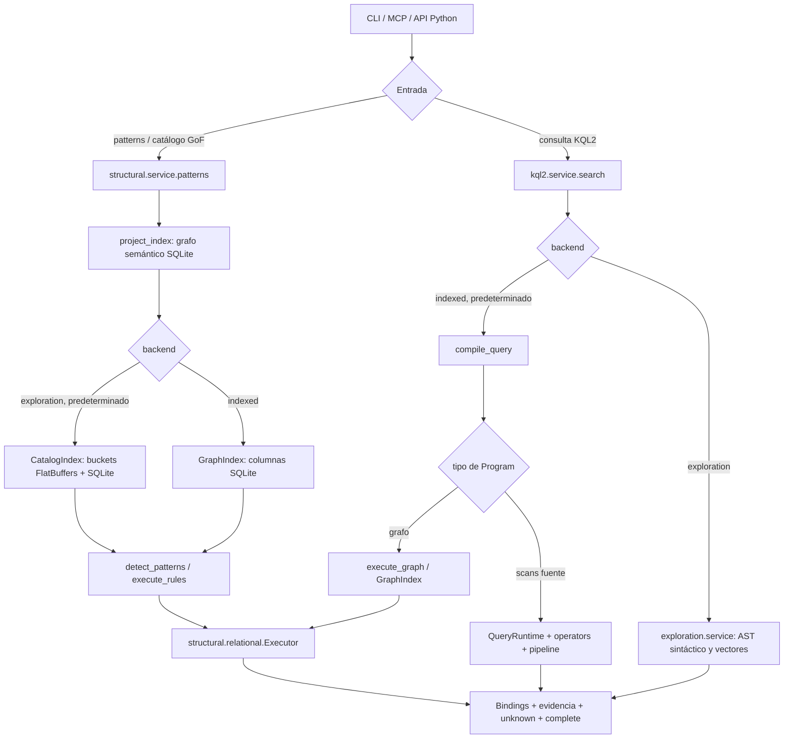
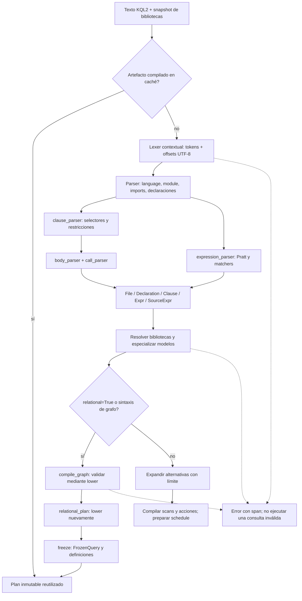
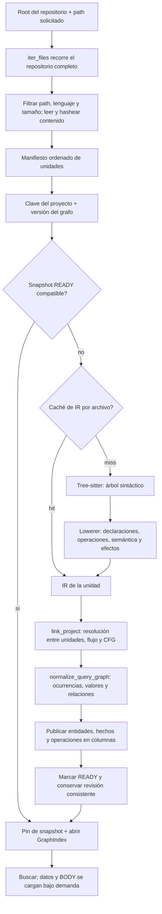
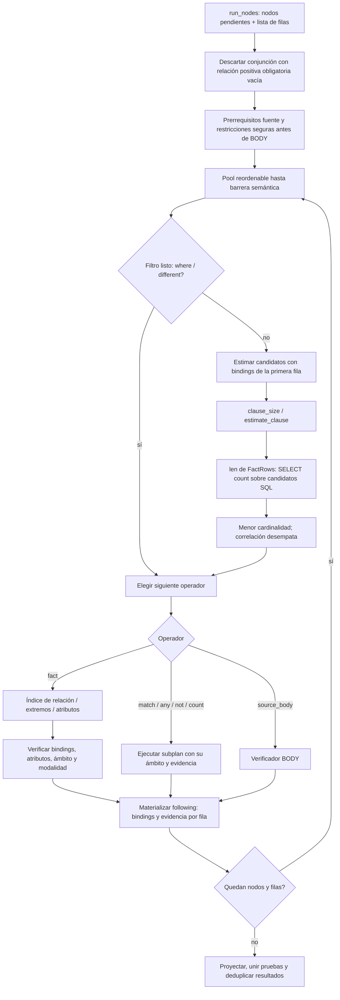
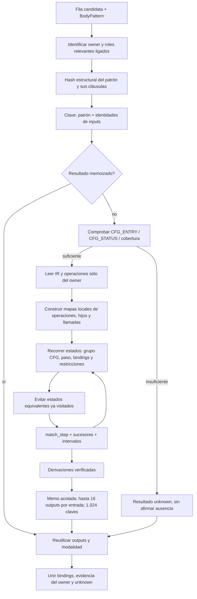
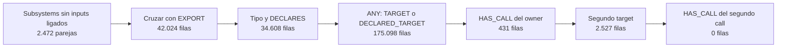
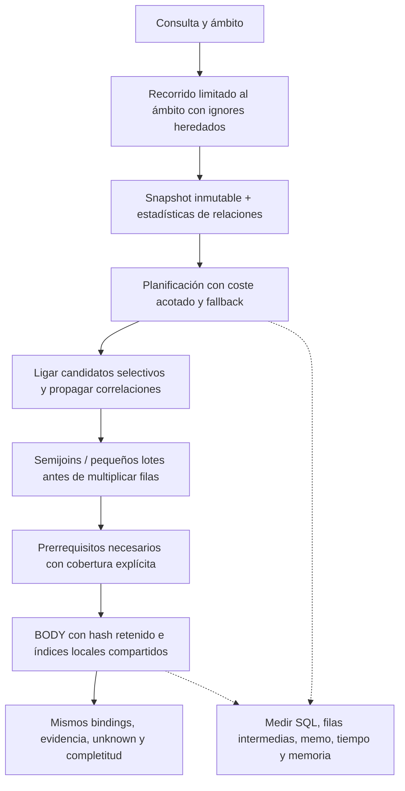

# KQL v2: recorrido de ejecución y oportunidades de optimización

Este informe conserva el diagnóstico anterior a las optimizaciones. Los cambios
posteriores y el requisito de 100 archivos en menos de 5 s con índice preparado
se documentan en [el seguimiento de latencia](latency-target-5s.md).

Auditoría del **20 de septiembre de 2026**, sobre el worktree existente de Ken
(HEAD `ff36cb69`, con cambios locales previos). Los diagramas describen el código
leído, salvo el último, que presenta una propuesta. Las pruebas añadidas son
scripts de diagnóstico: **esta auditoría no modifica el engine ni el catálogo**.

La lentitud se reproduce. Sobre los 26 archivos soportados de
`codex/sdk/typescript`, ejecutar los 23 patrones GoF tarda **15,16 s** de media
con el índice y la compilación reutilizados, backend híbrido y resultados sin
cachear. Parsear los **161 programas KQL2** disponibles tarda **0,103 s**;
reconstruir el registro con compilación caliente, **0,027 s**. La prioridad está
en el trabajo de búsqueda, las estimaciones SQL y el acceso al proyecto.

## 1. Qué engine se ejecuta realmente

Hay dos usos diferentes del nombre `exploration`. En el catálogo, es un
adaptador de acceso que conserva el grafo semántico, los joins y BODY. En una
consulta KQL2 directa, es el backend sintáctico con un subconjunto de capacidades.
Sus tiempos no son intercambiables. Los patrones del catálogo se compilan con
`relational=True`; no usan el pipeline iterativo de scans para ejecutar sus joins.

Código: [entrada del catálogo](../../../src/ken/structural/service.py),
[entrada KQL2](../../../src/ken/kql2/service.py),
[dispatch de ejecución](../../../src/ken/kql2/execution.py),
[adaptador híbrido](../../../src/ken/kql2/exploration/catalog_index.py).

## 2. Cómo parsea y compila KQL2

El lexer distingue `/` de regex por petición del parser. Los checkpoints guardan
el lookahead y su span: deshacer una alternativa no vuelve a tokenizarlo. La
compilación resuelve roles, tipos y restricciones del subconjunto implementado;
que una construcción se pueda parsear no garantiza que sea ejecutable.

El catálogo captura las bibliotecas y guarda planes inmutables en una caché de
8 MB dentro del proceso. En esta medición retuvo **161 entradas, 3,87 MB, sin
evicciones**. El primer registro completo tardó **0,633 s**; los siguientes,
**26–27 ms**. La caché de la API KQL2 directa tiene otro coordinador y también
puede leer artefactos persistidos. Un proceso nuevo no equivale a compilación
caliente del catálogo.

Existe trabajo duplicado en frío: `compile_graph` llama a `lower` para validar y
`relational_plan` vuelve a bajar las declaraciones. Se puede devolver y reutilizar
el plan validado, pero no es la explicación de los 15 segundos de búsqueda.

Código: [lexer](../../../src/ken/kql2/syntax/lexer.py),
[parser](../../../src/ken/kql2/syntax/parser.py),
[compiler](../../../src/ken/kql2/compiler.py),
[lowering de grafos](../../../src/ken/kql2/graph.py),
[caché del catálogo](../../../src/ken/kql2/catalog.py).

## 3. Cómo parsea el código y prepara el índice

El hit del índice evita Tree-sitter, linking y publicación, pero **no evita el
recorrido del repositorio ni leer los archivos del ámbito**. `source_manifest`
hace `sorted(iter_files(root))` antes de descartar rutas externas al subdirectorio.

En el SDK, la preparación fría fue **6,28 s**: manifiesto 1,66 s, construcción
fuente 1,31 s, normalización 0,05 s y publicación 3,12 s, más otros costes. Al
reutilizar el índice, el manifiesto sigue costando aproximadamente 1,6 s.

El prototipo `scoped_files` conserva el root, las reglas `.gitignore` heredadas y
las rutas relativas, pero comienza en el subárbol solicitado. En tres repeticiones
alternadas produjo **exactamente el mismo manifiesto, contenido y omisiones**:

| Mediana de la fase manifiesto | Actual | Prototipo |
|---|---:|---:|
| Tiempo | 1.573 ms | 6,29 ms |
| Archivos enumerados | 8.176 | 31 |
| Archivos soportados finales | 26 | 26 |

Es una mejora demostrada para búsquedas por subdirectorio. Buscar `path="."`
seguirá necesitando un recorrido completo. Antes de integrar: cubrir ignores
anidados, negaciones, targets ignorados, symlinks y cambios de `.gitignore`.

El cambio de un archivo reutiliza las unidades intactas, pero invalida la clave
del proyecto: vuelve a enlazar, normalizar y publicar el grafo. El linking y la
publicación incrementales son una mejora aparte, especialmente para repositorios
grandes; no están resueltos por la caché de unidades.

Código: [manifiesto y frontend](../../../src/ken/structural/service.py),
[adquisición](../../../src/ken/structural/index_service.py),
[Tree-sitter y lowering](../../../src/ken/structural/frontend.py),
[resolución](../../../src/ken/structural/semantic.py).

## 4. Cómo elige y ejecuta los joins

El planner es greedy y toma una fila representativa. No modela el coste total
de los siguientes joins, el tamaño de la evidencia ni el coste del matcher.
Las filas intermedias se materializan en listas; `facts` copia bindings y amplía
evidencia. La deduplicación pública ocurre después del trabajo de búsqueda.

**Problema de escala confirmado:** `estimate_clause` devuelve
`len(self.candidates(...))`. Aunque se denomine estimación, hace conteos exactos
del conjunto SQL de candidatos. Una caché evita repetir la misma sonda, pero no
abarata el primer conteo caro. `CatalogIndex` hereda ese método de `GraphIndex`:
los buckets vectoriales no eliminan este coste del planner.

En el snapshot semántico conservado de Codex, de **47.154.730 hechos**, la consulta
Iterator consumió un presupuesto de 5 s en planificación y examinó **0 hechos en
el executor**. La traza muestra `count(*)` con índices forzados y subconsultas de
atributos. Es una lectura real de SQLite que el contador `rows_examined` no cuenta.
El snapshot es previo: esta prueba no verifica el checkout actual ni mide tiempo
hasta completar el repositorio. Véanse los informes con y sin perfil de operadores.

La solución es separar **estimación**, **existencia** y **conteo semántico**:
estadísticas por snapshot, sondas acotadas y cotas para ordenar; `LIMIT 1` para
existencia cuando corresponda; conteo exacto cuando la consulta lo exige. Una
estimación aproximada nunca debe demostrar ausencia ni descartar bindings.
Además, presupuestar el propio planner y usar una heurística barata al agotarlo,
sin marcar una consulta sin ejecutar como completa.

Código: [planificador](../../../src/ken/structural/relational_planning.py),
[executor](../../../src/ken/structural/relational.py),
[estimación SQL](../../../src/ken/structural_store/graph_index.py),
[FactRows](../../../src/ken/structural_store/graph_rows.py).

## 5. Cómo verifica BODY y dónde se repite trabajo

El matcher ya usa estados visitados y memoización: no corresponde proponer
añadirlos como si faltaran. Los costes restantes incluyen:

1. **Hash recursivo en cada acceso a la memo.** `BodyPattern` es una dataclass
   inmutable cuyo hash vuelve a recorrer las cláusulas y expresiones. El perfil
   registra unos **20,9 millones de llamadas a `hash`** en el proceso; los callers
   ubican el trabajo dominante en la memo de `SourceExecutor.match`.
2. **Preparación por matching no memoizado.** El IR del owner está cacheado,
   pero `BodyEngine.match` reconstruye mapas de operaciones, hijos, spans y calls.
   Compartir un índice inmutable por owner/región evitaría repetir esa preparación
   entre patrones, manteniendo bindings, presupuestos y estado de prueba aislados.
3. **Inputs demasiado numerosos antes de BODY.** `command` entrega 19.656 filas
   a un BODY y recibe 5.796; cuatro sitios de `iterator` reciben 11.990 filas cada
   uno. Los dominios de prerrequisitos actuales cubren ciertos inserts y calls,
   no toda construcción o iteración. Nuevos prefiltros deben ser condiciones
   necesarias y conservar owners de cobertura incompleta.

**Experimento del hash, sin editar producción:** memoizar el valor estructural
original de cada objeto, reteniendo su identidad para evitar reutilización de
IDs. Orden de medición ABBA, índice caliente, los 23 patrones completos:

| Variante | Tiempos totales | Media |
|---|---|---:|
| Actual | 15,135 s; 15,235 s | 15,185 s |
| Hash memoizado | 13,437 s; 13,536 s | 13,486 s |

**11,2% menos tiempo total** en este ámbito. Las 546.888 consultas al hash de
BodyPattern necesitaron sólo 127 cálculos. Se conservaron los resultados, la
evidencia, los `unknown`, los estados y los hechos examinados de cada patrón.
Esto valida la oportunidad; dos muestras por variante no certifican una mejora
universal. Una implementación definitiva debería conservar el hash en el objeto
inmutable o en recursos de vida acotada, sin introducir una caché global sin límite.

Código: [SourceExecutor.match](../../../src/ken/kql2/source_execution.py),
[BodyPattern / BodyEngine](../../../src/ken/kql2/body.py),
[prerrequisitos existentes](../../../src/ken/kql2/source_candidates.py).

## 6. Caso concreto: explosión de filas en Facade

Este recorrido corresponde a `module-surface` en el SDK; las cifras son filas
intermedias, **no hallazgos**. La variante termina sin matches.

El primer `HAS_CALL` elimina **99,75%** de las 175.098 filas, después de haberlas
creado. La variante invoca `Subsystems` antes de ligar sus callables y el `any`
de resolución de targets actúa como barrera. Un mejor índice reduce el coste por
fila, pero no elimina esa multiplicación.

Propuesta concreta: localizar primero funciones exportadas y sus llamadas;
pasar sus extremos a `Subsystems` mediante un plan parametrizado, o propagar una
restricción por owner a **ambas** ramas de resolución de targets. Hace falta un
contrato de inputs/outputs y una transformación específica para alternativas
positivas; quitar todas las barreras de `any` o `match` rompería ámbitos y pruebas.
Cuando sólo se necesita existencia, un semijoin puede evitar materializar
combinaciones, siempre que la multiplicidad y la evidencia pública lo permitan.

Validación exigida: mismos bindings, modalidades y pruebas en ambas ramas,
targets posibles/declarados, casos de shadowing y cobertura parcial. Esta
reescritura **no está implementada ni tiene un speedup medido** en la auditoría.

Código: [patrón Facade](../../../src/ken/structural/patterns/facade.toml),
[barreras y selección](../../../src/ken/structural/relational_planning.py),
[operadores](../../../src/ken/structural/relational_operators.py).

## 7. Orden de trabajo propuesto

| Prioridad | Cambio | Evidencia y criterio de aceptación |
|---|---|---|
| P0, escala | Reemplazar conteos exactos de planificación por estimaciones acotadas | Iterator consume 5 s antes de examinar hechos. Medir planificación separada y completar más trabajo sin cambiar semántica. |
| P1, mejora pequeña medida | Retener hash de BodyPattern | Prototipo: 15,185 → 13,486 s. Misma evidencia y contadores; probar reemplazos de AST, colisiones y vida de caché. |
| P1, búsquedas locales | Recorrer sólo el ámbito pedido | Manifiesto: 1.573 → 6,29 ms. Preservar ignores, rutas, contenido y omisiones. |
| P1, trabajo multiplicativo | Parametrizar subplanes y propagar restricciones seguras | Facade crea 175.098 filas antes de reducir a 431. Medir filas máximas y coste de pruebas, no sólo tiempo. |
| P2, BODY | Ampliar prerrequisitos y compartir preparación del owner | Contar invocaciones, hits/misses y construcciones de índices locales. Unknown debe seguir siendo unknown. |
| P2, edición frecuente | Linking y publicación incrementales | Hoy un manifiesto nuevo deriva un grafo nuevo. Comparar edición de un archivo con reconstrucción completa. |
| P3, arranque | Evitar el segundo lowering y compilar sólo dependencias alcanzables | Registro frío completo: 0,633 s; caliente: 0,027 s. Menor prioridad que búsqueda. |

Antes de cambiar de lenguaje o mover kernels a Rust, conviene eliminar conteos
caros, hashes repetidos y filas innecesarias. Ya existen índices SQL, cachés
acotadas, predicados anticipados y memo de BODY. Reescribir esos componentes sin
atacar el trabajo que realizan conservaría los problemas de escala.

## Mediciones, alcance y reproducción

| Recorrido de 23 patrones, perfil de operadores activado | Indexed | Híbrido |
|---|---:|---:|
| Primera llamada del proceso | 21,846 s, índice frío | 15,984 s, índice ya caliente |
| Caliente 1 | 16,799 s | 14,999 s |
| Caliente 2 | 16,892 s | 15,326 s |
| Media caliente | **16,845 s** | **15,162 s** |

Las primeras llamadas **no son una comparación de frío contra frío**: ambos
backends compartieron el directorio de caché. Las medias calientes muestran una
reducción del 10,0% para el híbrido en esta ejecución. No hubo límites de tiempo
ni resultados recuperados de caché en el SDK. Los seis recorridos completaron,
con dos findings y hash semántico idéntico
`68a0c59874b83214fb0420e3369829f7041447a8e21b8eac9c3706193efdd5cd`.

En el último recorrido híbrido, 13,65 s correspondieron a consultas:
Iterator 2,91 s, Facade 2,71 s, Command 2,67 s, Singleton 1,88 s y Mediator
1,27 s. Esos cinco concentran aproximadamente el 84% del tiempo de consultas.
El índice contiene 5.098 entidades y 94.197 hechos.

Se ejecutó además cProfile en un proceso separado. Elevó el tiempo total a
40,26 s: sirve para localizar trabajo, **no para calcular speedups** contra las
mediciones anteriores. Los tiempos de operadores de grafos son inclusivos;
sumar padres e hijos cuenta trabajo dos veces. El perfil añade estimaciones
incluso para algunos grupos con un solo scan; el diagnóstico grande se repite
también sin perfil de operadores para comprobar esa diferencia.

Evidencia, scripts, procedencia de los inputs y comandos:
[carpeta de validación](../../structural-validation/kql2-pipeline-audit-2026-09-20/README.md).
Las propuestas de cambios de planner/joins requieren la matriz diferencial del
catálogo y fixtures adversariales antes de integrarse. Esta auditoría demuestra
cuellos de botella y dos oportunidades concretas; no demuestra que los 23
patrones completen en un repositorio de decenas de millones de hechos.
