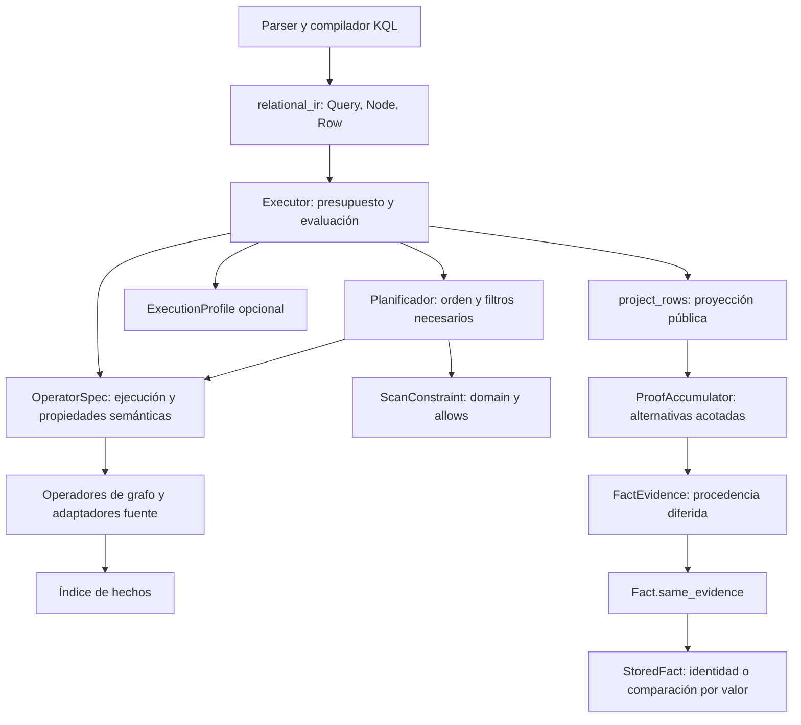
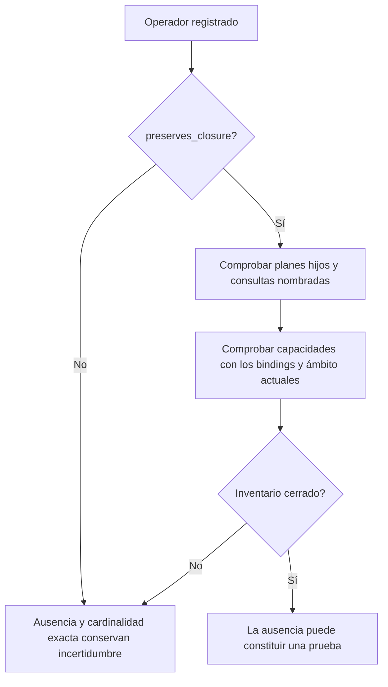

# Interfaces del runtime KQL — 21 de septiembre de 2026

El runtime compartido por KQL1 y KQL2 separa el modelo del plan, la ejecución,
los diagnósticos y la construcción de resultados. `relational.py` conserva los
imports públicos de `Node`, `Query`, `Row`, `RELATIONS` y `merge_proofs`; las
extensiones existentes y los snapshots locales anteriores siguen siendo legibles.

## Dependencias y responsabilidades



Las flechas muestran el recorrido y los contratos; el frontend puede acceder al
modelo por los imports de compatibilidad. Los módulos de evidencia, términos y
modelo no importan el ejecutor. Las estrategias sólo importan su tipo durante el
chequeo estático. `ExecutionProfile` recibe el ejecutor durante una llamada y no
retiene una referencia a él ni al índice.

| Componente | Responsabilidad |
|---|---|
| `relational_ir` | Registros del plan y de las filas; contrato `ScanConstraint` |
| `relational_terms` | Comparación literal y comparación heredada con alternativas |
| `relational_operators` | Handlers y propiedades semánticas de cada operador |
| `relational_planning` / `relational_closure` | Selección de joins y posibilidad de demostrar inventario cerrado |
| `relational_profile` | Costes inclusivos, parentesco, selección y trabajo interrumpido |
| `relational_evidence` | Referencias a hechos, unión de pruebas y materialización |
| `relational_results` | Exports públicos, certeza, deduplicación y límite de resultados |
| `relational` | Coordinación, presupuesto y alcance de acceso al índice |

## Contrato para extender operadores

Un handler recibe el ejecutor, el nodo, una fila, el lote de salida y una
restricción opcional. Añade las filas al lote recibido. `OperatorSpec` reúne:

- `barrier`: si el planificador puede cruzar ese operador.
- `clears_scan_constraints`: si debe recalcular los filtros de candidatos.
- `preserves_closure`: si el cierre puede decidirse mediante capacidades de
  hechos y planes hijos. El valor predeterminado es `False`.



Declarar cierre no basta para demostrarlo: siguen vigentes las comprobaciones
dinámicas por sujeto y relación. Los operadores fuente describen testigos y no
declaran inventarios completos. Un operador nuevo no puede convertir falta de
resultados en una prueba de ausencia por omitir este contrato.

`ScanConstraint.domain(bindings, role)` devuelve `None` para dominio libre, un
conjunto vacío para imposibilidad demostrada y un conjunto finito para candidatos
permitidos. `allows(bindings)` verifica la restricción. Ambos son filtros
necesarios: nunca sustituyen la evaluación de hechos ni eliminan incertidumbre.

## Evidencia y límite público

```mermaid
sequenceDiagram
    participant E as Executor
    participant I as Índice
    participant P as project_rows
    participant A as ProofAccumulator
    participant F as Fact / StoredFact
    E->>I: Evaluar operadores bajo presupuesto
    I-->>E: Filas con referencias de evidencia
    E->>P: Filas, exports, modo, máximo de resultados
    P->>A: Añadir testigos de cada binding público
    A->>F: same_evidence cuando la igualdad importa
    F-->>A: Comparación válida para ese almacenamiento
    A-->>P: Hasta 16 pruebas; certeza y truncamiento
    P-->>E: Matches proyectados y motivos de incompletitud
    E->>I: Materializar pruebas dentro del presupuesto
    E-->>E: Resultado público sin referencias al índice
```

El límite de pruebas y el límite de resultados son independientes. Duplicados de
un binding ya admitido todavía pueden aportar evidencia cuando el máximo de
resultados está lleno. La proyección utiliza un acumulador por binding, sin
reconstruir el grupo de alternativas con cada fila. Tampoco reordena el lote del
llamador.

La capa relacional ya no lee `_reader` ni `_evidence` del almacenamiento.
`StoredFact.same_evidence` puede aprovechar identificadores de documentos
inmutables del mismo lector mientras ninguna lista se haya decodificado. Tras
decodificar, compara los valores públicos: una modificación local debe ser
observable. Los atributos y evidencias mutables no se comparten entre registros.

## Validación

Las pruebas cubren extensiones con inventario abierto/cerrado, almacenamiento
alternativo, modificación de evidencia nativa, proyección con duplicados y
límites, conservación de certeza, presupuestos interrumpidos y liberación del
ejecutor aun si se retiene el perfil. También se verificó la lectura de un pickle
producido por la versión anterior con los imports públicos originales.

La suite completa `tests/kql2 tests/structural` terminó con **13.184 pruebas
aprobadas y 10 fallos esperados**, en 414,84 s. Incluye 14 casos nuevos de
contratos entre componentes.

Las mediciones A/B usan el índice preparado, sin caché de resultados, y comparan
bindings, pruebas e incertidumbre. Los resultados y comandos se archivan en
`docs/structural-validation/kql2-runtime-refactor-2026-09-21/`.

| Consulta completa | Antes | Después |
|---|---:|---:|
| Interpreter, corpus fijo de 100 archivos | 3,392 s | 3,224 s |
| Los 23 GoF, SDK de 26 archivos | 5,798 s | 5,896 s |

Se informa la segunda ejecución de cada proceso; se conservan las dos muestras
en los artefactos. Los hashes semánticos coinciden en las cuatro parejas. Es una
comprobación de estabilidad, no una demostración estadística de aceleración.
La preparación del índice se hace fuera del cronómetro en ambas versiones.

El chequeo de tipos de los 14 módulos afectados pasa. El chequeo global conserva
454 errores anteriores fuera de esos módulos, frente a 461 antes del refactor:
se eliminaron los siete del ejecutor y no aparecieron errores nuevos.

Este refactor no demuestra el objetivo global de menos de 5 s para los 23
patrones sobre 100 archivos. El último gate completo sigue documentado en
[evidencia diferida](late-materialization-2026-09-21.md).
