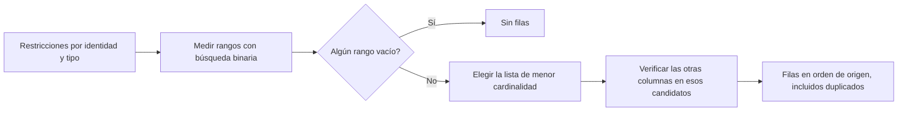
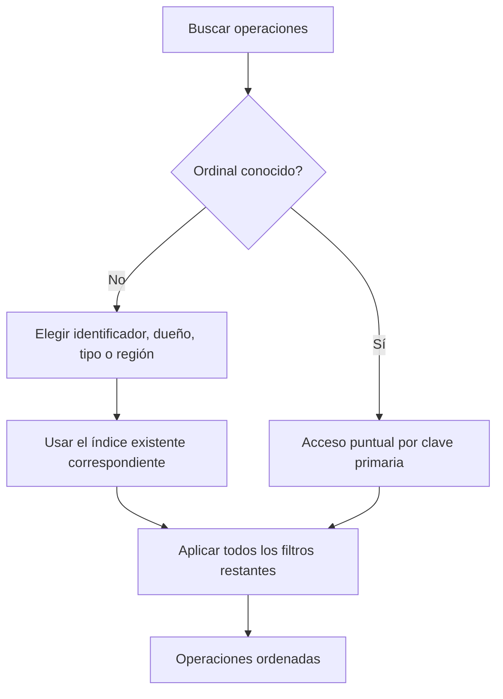
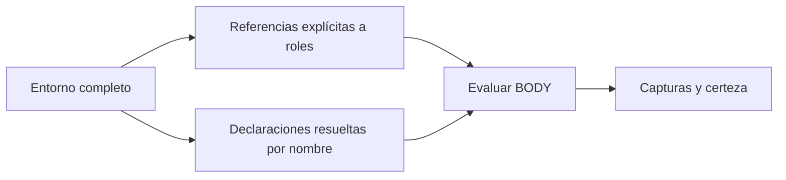

# Accesos selectivos a KQL — 21 de septiembre de 2026

Esta ronda optimiza los accesos físicos. Conserva los
joins, la semántica de incertidumbre, los límites de evidencia y el catálogo.
La comparación parte del runtime ya refactorizado, incluidos sus cambios sin
commit.

## Selección por la lista más pequeña

`Records.select` intersectaba las listas de posiciones de todas las columnas.
Una búsqueda por identidad y tipo podía intersectar un único candidato con miles
de posiciones del mismo tipo. `numpy.intersect1d` reconstruía y ordenaba esas
listas para cada identidad distinta.

Ahora obtiene las cardinalidades mediante búsquedas binarias sobre los índices
ordenados. Materializa la lista más pequeña y verifica las otras columnas sólo
en esas posiciones. El orden de las restricciones no determina el coste de la
intersección.

Las alternativas de una columna se deduplican antes de elegir rangos; las filas
distintas con valores iguales siguen siendo filas distintas. La unión de rangos
se ordena por posición de origen. Una tupla de alternativas vacía selecciona cero
filas, también en columnas numéricas. El formato FlatBuffers permanece intacto.

## Acceso a operaciones por el dato conocido

En el corpus de 100 archivos, `EXPLAIN QUERY PLAN` mostró que una consulta por
`local_id` usaba la clave primaria sólo con `graph_id`. SQLite prefería recorrer
las operaciones del proyecto para entregar `ORDER BY ordinal`, aunque ya había
un índice `(graph_id, local_id, ordinal)`.

La consulta ahora declara el acceso físico correspondiente:

| Dato disponible | Acceso |
|---|---|
| Ordinal | Clave primaria `(graph_id, ordinal)` |
| Identificador local | `k2_graph_operation_id` |
| Dueño | `k2_graph_operation_owner` |
| Tipo de operación | `k2_graph_operation_kind` |
| Región sintáctica, sin los anteriores | Identificadores de esa región mediante `k2_graph_operation_id` |

Todos los filtros siguen formando una conjunción y los resultados conservan el
orden por ordinal. No se añaden índices ni se cambia el esquema almacenado.

## Límite de la proyección de BODY

Se probó construir el entorno de BODY sólo con los roles de su clave de
memoización. La suite completa detectó 109 regresiones y se retiró ese cambio;
los 109 casos vuelven a pasar. El evaluador también resuelve miembros literales
por nombre entre todas las declaraciones del entorno. Esas dependencias no
aparecen necesariamente como referencias explícitas a roles en el AST.

Una futura proyección necesita un contrato de dependencias completo, compartido
por compilador, memoización y evaluador. El entorno completo se conserva.

## Validación

Resultado final: **13.202 pruebas pasan y 10 tienen fallo esperado**, en 418,75 s.
Los dos módulos modificados pasan mypy. Se añadieron 18 pruebas de selección y
acceso puntual. El log y el resumen están en `pytest.log` y `validation.json`
del directorio de validación.

Las pruebas diferenciales comparan la selección vectorial con un recorrido de
referencia: alternativas repetidas, columnas en distinto orden, nulos, texto
vacío, valores negativos, filas duplicadas y conjuntos vacíos. Las pruebas SQL
cuentan instrucciones de la máquina virtual, para verificar que una búsqueda
puntual no recorra 3.000 operaciones ajenas. La conformidad del catálogo compara
evidencia entre los backends nativo y vectorial.

Los tiempos y resultados completos se registran en
`docs/structural-validation/kql2-selective-access-2026-09-21/`. Las consultas que
agotan su presupuesto se identifican como incompletas y no se utilizan para
afirmar equivalencia de resultados completos o aceleración de una búsqueda
terminada.

| Consulta completa, índice preparado | Antes | Después |
|---|---:|---:|
| Strategy / 100 archivos | 6,977 s | 5,513 s |
| 23 GoF / SDK de 26 archivos | 6,265 s | 5,694 s |
| Interpreter / 100 archivos | 3,533 s | 3,507 s |

Se informa la segunda ejecución de cada proceso. Las dos muestras de cada
variante están archivadas; los hashes de resultados, evidencia e incertidumbre
coinciden. Interpreter se mantiene prácticamente igual: la variación es
inferior al 1 % y no demuestra una mejora relevante.

En los microbenchmarks, la mediana de 2.000 selecciones sobre 20.000 filas pasa de
3,801 s a 0,0152 s. Cien búsquedas de operaciones por identificador pasan de
1,342 s a 0,00135 s. Son mejoras de esos accesos, no del tiempo total de búsqueda.

El gate completo de 23 GoF / 100 archivos sigue **sin pasar**: 71,077 s y diez
consultas incompletas antes; 64,699 s y ocho incompletas después. En este lote
Abstract Factory termina en 1,610 s y Strategy en 4,950 s. Quedan incompletos
Builder, Command, Iterator, Mediator, Memento, Observer, Singleton y Template
Method. Los tiempos limitados por presupuesto no representan búsquedas completas.
Este gate usa un proceso nuevo, sin calentamiento de consultas; no se debe
comparar directamente con mediciones anteriores que descartaban una primera
ejecución.

## Próximo límite a resolver

Estos cambios abaratan cada acceso. El siguiente problema es la cantidad de
combinaciones que se evalúan: en el lote final Strategy todavía recorre
1.636.174 estados. Hace falta reducir candidatos antes de evaluar BODY mediante
restricciones cuya equivalencia pueda demostrarse, manteniendo las dependencias
por nombre y la incertidumbre. La proyección descartada muestra por qué ese
contrato debe incluir más que las referencias explícitas a roles.
