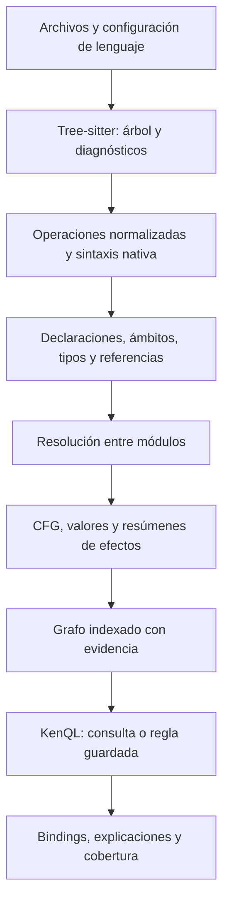

# Especificación propuesta del IR

Estado: contrato objetivo, parcialmente implementado. Volver al [índice](README.md).
La referencia ejecutable es la [guía IR](../../structural-ir.md); este
documento conserva también requisitos futuros y no certifica que estén completos.

La revisión parte ahora de [algoritmos descritos en palabras](algorithms-to-ir.md)
y del [núcleo de instrucciones](instruction-ir.md). Declaraciones y hechos
derivados se distinguen del cuerpo: valores temporales, lugares mutables,
instrucciones con operandos/resultados, regiones y efectos. La exportación inicial
coexiste con el grafo y no acredita por sí sola los análisis pendientes de heap,
aliasing, copia, paso por referencia o invariantes de intervalos generales.

| Área | Estado de la implementación actual |
|---|---|
| Operaciones y operandos | Sintaxis preservada; comparación, aritmética, lógica, asignación y actualización consultables. Sin resolución general de sobrecargas. |
| Tipos estructurados | Descriptores de anotaciones y literales, parámetros de contenedores, any/unknown separados. Sin inferencia completa ni identidad de APIs por el nombre del tipo. |
| Control | CFG de statements para ramas y bucles, break/continue/return. Excepciones, suspensión y evaluación de expresiones quedan fuera de su garantía. |
| Orígenes de retornos | Bloques e if/else/elif de cinco lenguajes, con alternativas explícitas. Falta el punto fijo de flujo de valores en bucles y análisis de heap/alias general. |
| Valores retornados consultables | RETURNS_VALUE usa orígenes del pase soportado, preservando modalidad y operación de retorno; fuera del pase conserva basis=syntax. |
| Bindings de llamadas | [Implementados por ocurrencia](call-bindings.md), con constructor explícito único, argumentos posicionales y nombrados restringidos; sin overloads ni expansión variádica. |
| Valores iniciales de campos | [IR 1.45.0](field-initial-values.md): declaradores reales, operandos explícitos, defaults acotados por lenguaje y ausencia/unknown separados. No estado final del heap. |
| Inicialización lazy directa | [IR 1.44.0](lazy-null-flow.md): NULL_TEST bajo negaciones lógicas y búsqueda de ramas de escritura/retorno con CFG; no prueba sincronización ni memoria compartida estable. |
| Acceso a construcción | [IR 1.43.0](restricted-eager-singleton.md): inventarios de constructores explícitos Java/C#/TS y sitios de creación resueltos; no unicidad global ni análisis completo de aliases. |
| Clases como valores | [IR 1.42.0](class-expression-factories.md): expresiones de clase JS/TS por ocurrencia, bases léxicas Python/JS/TS, aserciones TypeScript que conservan el valor. No sustituye bases runtime ni resuelve todos los aliases de constructor. |
| Campos y llamadas static | [IR 1.41.0](eager-singleton.md): identidad de campos privados JS/TS y métodos static propios de receptores ya resueltos a clase en Java/C#/JS/TS; excluye getters/setters, herencia y receptores importados aún sin resolver. |
| Callables entre paréntesis | [IR 1.40.0](callable-dependency-injection.md): CALLEE_VALUE preserva el binding de identificadores, miembros e indexaciones entre paréntesis. No reinterpreta casts ni resuelve todos los receivers. |
| Última entrada de binding | [IR 1.39.0](strategy-binding-inputs.md): FINAL_BINDING_INPUT/BINDING_FLOW_STATUS para últimas escrituras explícitas en ocho gramáticas; separado de retención de campos y de efectos de descriptores. |
| Transferencias de campos | Parámetro a campo, getter directo y última escritura en cuerpos lineales de Python/JS/TS/Java/C#/C++; no prueban pureza ni inmutabilidad del heap. |
| Producto almacenado | [IR 1.31.0](stored-product-builder.md): raíz nominal de anotaciones Rust sin borrar argumentos, inicializadores explícitos/shorthand y última escritura directa de parámetro a miembro en seis lenguajes. Sin aliasing global ni igualdad de especializaciones. |
| Configuración por miembros | [IR 1.32.0](builder-input-writes.md): última entrada directa a campos y miembros en ocho lenguajes, sin reasignación del parámetro; no soporta control no lineal ni efectos ocultos. |
| Predicados e inventarios | [IR 1.33.0](read-through-cache.md): TRUTH_TEST y ausencia/unicidad de escrituras explícitas por callable; permiten read_fill con CFG y orígenes de retorno. No son prueba de pureza ni ownership. |
| Conteos por callable | [IR 1.34.0](cache-aside-flow.md): BINDING_WRITE_COUNT cuenta asignaciones explícitas en ámbitos soportados, incluyendo ramas y código muerto. No cuenta ejecuciones ni inicialización implícita; ausencia no equivale a cero. |
| Raíces nominales y almacenamiento | [IR 1.35.0](patterns/bridge.md): NOMINAL_ROOT/STATUS para bases explícitas resueltas y raíz única; static/const de C# en la declaración de campo. No incluye bases implícitas ni herencia runtime. |
| Declaradores C++ | [IR 1.36.0](cpp-field-declarators.md): identidad de campos con indirecciones/cualificación; TYPE_HEAD_STATUS separa heads simples de tipos opacos. Raíces nominales incluyen C++. |
| Métodos C++ | [IR 1.37.0](cpp-method-contracts.md): prototipos como callables; firmas cv/ref y virtualidad heredada para OVERRIDES. METHOD_SIGNATURE_STATUS explicita firmas no disponibles; no resuelve overloads de llamadas ni sustituye templates. |
| Inicializadores C++ | [IR 1.38.0](cpp-constructor-initializers.md): ocurrencias explícitas, campos propios y argumentos fuente separados; entradas directas soportadas preceden al cuerpo en el pase de retención. Bases, delegación y conversiones no modeladas impiden afirmar retención final. No se inventa orden CFG de la lista. |
| Contexto y contratos | Parámetros-propiedad TypeScript con identidades separadas; `INSTANCE_RECEIVER`, `CONSTRUCTOR_FIELD_INPUT` y slot `DECLARED_TARGET`. No son identidad runtime ni resolución completa de dispatch. |
| Ciclo de colecciones | Literales vacíos, resets explícitos/API clear y orden léxico después de una iteración. No prueban FIFO, progreso ni entrega exactamente una vez. |
| Usos de patrones | Nueve operaciones públicas en TOML: `singleton.shared_instance`, `singleton.lazy_instance`, `iterator.iterate_over`, `prototype.derived_copy`, `command.retained_dispatch`, `strategy.supplied_policy`, `architecture.batch-work-queue.drain`, `architecture.read-through-cache.read_fill` y `persistence.unit-of-work.keyed_flush`. Se componen mediante `match`; map/filter y el azúcar `%… do … %end` siguen pendientes. |
| Copias de colecciones | Modelos de list/tuple y Array.from sin mapper; procedencia de iteración mediante aliases locales restringidos. Sin análisis general de heap ni garantía de ejecución. |
| Productores y elementos iterados | Origen de iterable en una llamada y paso del elemento por posición de argumento, bajo restricciones de bindings y aliases. No prueban efectos ocultos ni ejecución. |
| Uso de resultados de llamadas | `DISCARDS_RESULT` identifica una llamada cuyo resultado descarta una sentencia, con paréntesis/await admitidos. No prueba efectos del callee. |
| Miembros heredados | Slots de instancia y métodos visibles para herencia simple Python/JS/TS; accesos derivados de parámetros mediante aliases restringidos. Sin MRO múltiple ni pureza de getters. |
| Copia de campos después de construir | [Implementada con límites](field-copy.md): `RETURN_FIELD_STATE`/`FIELD_STATE_ORIGIN`/`FIELD_STATE_WRITE` preservan identidad de asignación y última escritura en estados separados por rama. No equivalen a un heap completo. |
| Cobertura | Estados locales de CFG y del pase de retornos. No equivalen a completitud semántica global ni a ausencia de bugs. |

## 1. Objetivo y capas

El IR debe contestar tanto «¿dónde hay un parámetro de tipo entero?» como «¿qué
valores devueltos por una factory terminan en un consumidor?» sin reconstruir todo
el AST en cada consulta. No será un lenguaje para ejecutar código ni un IR de
optimización que borra nombres y estructuras relevantes para personas.



Las capas se calculan según las capacidades que necesita la consulta. Buscar un
nombre de parámetro no debe construir análisis interprocedural. Cada capa puede
producir información parcial, con su propia versión y dependencias de caché.

## 2. Unidad de análisis y serialización

Un `Snapshot` identifica el conjunto coherente de archivos analizados. Contiene:

Este es el formato objetivo. El formato implementado usa `version`, `path`,
`language`, `entities`, `operations`, `facts`, `capabilities`, `diagnostics`,
`relations` y `view`; ver [serialización y vista KenQL](../../structural-ir.md#serialized-source-graph-and-kenql-view).

| Campo | Contenido |
|---|---|
| `schema_version` | Versión del formato de intercambio |
| `semantics_version` | Versión del significado de normalizaciones y relaciones |
| `snapshot_id` | Hash del manifiesto de contenidos y configuración |
| `units` | Módulos y hashes del texto exacto analizado |
| `entities` | Declaraciones, valores, tipos, lugares, contextos y regiones |
| `operations` | Operaciones con operandos, resultados y fuente |
| `edges` | Relaciones tipadas con atributos y evidencia |
| `coverage` | Capacidades y completitud por unidad/ámbito/relación |
| `diagnostics` | Errores de parseo, resolución y límites |
| `dependencies` | Entradas de las que depende cada derivación |

JSON es el formato legible de intercambio inicial, no una obligación de guardar
millones de objetos JSON en RAM. Internamente se podrán usar tablas columnares,
IDs enteros e índices compactos. La misma serialización debe poder consumirse desde
Python, Rust, CLI y MCP.

Un fragmento ilustrativo, con IDs abreviados para lectura:

```json
{
  "schema_version": "draft-2",
  "snapshot_id": "sha256:...",
  "entities": [
    {"id": "m:make", "kind": "callable", "name": "make", "scope": "module:a"},
    {"id": "t:Product", "kind": "type_decl", "name": "Product"},
    {"id": "v:created", "kind": "value", "origin": "op:new"}
  ],
  "operations": [
    {"id": "op:new", "kind": "construct", "owner": "m:make",
     "operands": [], "results": ["v:created"], "source": "span:1"}
  ],
  "edges": [
    {"from": "v:created", "relation": "INSTANCE_OF", "to": "t:Product",
     "basis": "resolved", "modality": "must", "evidence": ["span:1"]},
    {"from": "m:make", "relation": "RETURNS_VALUE", "to": "v:created",
     "basis": "syntax", "modality": "must", "evidence": ["span:2"]}
  ]
}
```

`must` aquí significa que la relación representada se sostiene bajo las hipótesis
registradas: la sintaxis contiene ese retorno. No significa que el método vaya a
ser llamado ni que esa operación se ejecute en todas las ejecuciones.

## 3. Identidad y localización

Un ID es opaco. Dentro de un snapshot debe distinguir archivo, ámbito léxico,
declaración y ocurrencia. Dos métodos sobrecargados, dos variables `x` en bloques
anidados y dos clases `User` de paquetes diferentes tienen identidades distintas.
Una referencia y la declaración a la que apunta también son entidades distintas.

Los IDs se pueden mantener ante cambios no relacionados cuando resulte barato,
pero no se promete identidad estable entre versiones de un archivo. Para comparar
snapshots se necesita una correspondencia explícita, con confianza y posibles
ambigüedades; nunca enlazar por coincidencia de números de línea.

Cada `SourceSpan` incluye unidad, hash de contenido, intervalo de bytes UTF-8
`[start,end)`, línea y columna de presentación. Líneas/columnas de presentación
empiezan en 1; columnas internas y puntos de tree-sitter no se exponen como si
fueran caracteres Unicode. Las operaciones sintéticas referencian spans originales
y declaran `synthetic=true`, sin inventar texto fuente.

Una misma regla puede involucrar cuatro archivos. Sus resultados conservan todas
las localizaciones relevantes, además de una primaria para navegación.

## 4. Clases de entidad

| Clase | Ejemplos | Diferencia importante |
|---|---|---|
| `module`, `namespace`, `scope` | archivo, paquete, bloque léxico | El archivo físico no siempre coincide con un módulo lógico |
| `type_decl`, `contract` | clase, struct, interface, trait, protocolo | Una capacidad no exige herencia |
| `callable` | función, método, closure, constructor, accessor | Mantiene mecanismo de despacho y receptor |
| `parameter` | posicional, keyword-only, rest, receptor | Es un lugar de la firma, no el argumento suministrado |
| `argument_occurrence` | argumento en un sitio de llamada/construcción | Conserva posición/keyword/spread y enlace al valor |
| `storage` | local, campo, global, elemento abstracto | Puede recibir distintos valores |
| `value` | literal, resultado de llamada, phi, objeto abstracto | Describe un valor en un punto/flujo |
| `type` | tipo nominal, unión, genérico, referencia | La anotación no prueba el tipo runtime exacto |
| `reference`, `import`, `export` | uso de símbolo, alias, reexportación | La visibilidad y la resolución son relaciones diferentes |
| `region`, `block` | rama, bucle, try, cuerpo suspendible | Contención léxica no prueba orden de ejecución |
| `execution_context` | tarea, thread, goroutine | Crear un handle no demuestra que empezó |
| `resource` | lock, archivo, socket, transacción | Requiere modelos de identidad y ciclo de vida |

Un objeto concreto runtime se aproxima mediante un sitio de asignación y un
contexto. Dos evaluaciones del mismo sitio pueden crear objetos diferentes. El IR
no confunde esa abstracción con una instancia singleton real.

## 5. Tipos y conocimiento

Un `TypeRef` es una estructura, no una cadena separada por comas:

```text
Nominal(module="app.users", name="User", arguments=[])
Generic(base=List, arguments=[Nominal(User)])
Union([Nominal(User), Null])
Callable(parameters=[Int], returns=String, effects=[MayThrow])
Reference(target=Nominal(User), mutable=false, lifetime="'a")
Tuple([String, Int])
TypeParameter(name="T", constraints=[Contract(Clone)])
```

Separar `declared_type`, `inferred_type`, `possible_runtime_types` y
`type_knowledge`. Los valores de conocimiento son `known`, `partial`, `unknown`,
`conflict`; el tipo TypeScript `unknown` sigue siendo un tipo declarado conocido.
`any`, `dynamic`, nulabilidad y tipos sin información tampoco son equivalentes.

La normalización de primitivas conserva semántica: `str`, `string` y `String`
pueden compartir familia `string`, manteniendo sus tipos nativos; `number` de
JavaScript no se convierte en `int`; ancho, signo, overflow, boxing y mutabilidad
siguen disponibles. Una consulta elige igualdad nominal, familia o compatibilidad.
La compatibilidad depende del lenguaje y de su configuración.

TypeScript usa compatibilidad estructural, por lo que una relación de contrato no
puede depender solamente de `implements`. [Documentación de TypeScript](https://www.typescriptlang.org/docs/handbook/type-compatibility).

## 6. Operaciones, operandos y orden

Vocabulario normalizado inicial:

| Grupo | Operaciones |
|---|---|
| Valores | `constant`, `load`, `store`, `phi`, `construct`, `copy`, `move`, `borrow` |
| Llamadas | `call`, `invoke_dynamic`, `return`, `throw` |
| Control | `branch`, `switch`, `loop`, `break`, `continue`, `match` |
| Suspensión | `yield`, `yield_delegate`, `await`, `resume`, `generator_stop` |
| Recursos | `resource_enter`, `resource_exit`, `defer`, `drop` |
| Módulos | `import`, `export`, `reexport` |
| Efectos modelados | `spawn`, `join`, `cancel`, `lock_acquire`, `lock_release`, `send`, `receive` |
| Escape | `native` con `language`, `native_kind`, hijos y tokens relevantes |

Cada operación conserva owner, región, operandos **ordenados**, resultados,
condiciones, fuente y propiedades nativas. Conservar la estructura de la expresión
impide confundir `a - b` con `b - a` o `lock.acquire()` con un método homónimo.

El orden fuente solo produce `LEXICALLY_PRECEDES`. `CFG_NEXT` describe transferencia
posible dentro de una función, con etiquetas `true`, `false`, `exception`, `finally`,
`resume`, `cancel`. `DOMINATES` y `POSTDOMINATES` solo se materializan para CFGs con
cobertura suficiente. `HAPPENS_BEFORE` pertenece al modelo de concurrencia: no se
deriva de la posición textual entre dos funciones.

Un retorno en `finally` puede reemplazar otro resultado. Un `yield` no es un
`return` normal. Un destructor implícito necesita una derivación de lenguaje,
incluyendo las condiciones bajo las que ocurre.

## 7. Relaciones públicas y sus firmas

Los extremos de aristas son IDs de entidad/operación. Literales y nombres se
consultan como atributos tipados. Cada relación registra tipos permitidos de
extremos, atributos, significado, derivador y requisitos de completitud.

| Relación | Origen → destino | Significado |
|---|---|---|
| `DECLARES` | scope → declaración | Declaración en ese ámbito |
| `HAS_METHOD`, `HAS_FIELD` | type_decl → callable/storage | Miembro declarado; heredado usa atributo/origen explícito |
| `HAS_PARAMETER` | callable → parameter | Firma y posición explícita |
| `HAS_OPERATION` | callable → operation | Dueño de ejecución, excluye closures anidadas |
| `EXTENDS` | type_decl → type_decl | Herencia declarada |
| `IMPLEMENTS` | type_decl → contract | Implementación nominal/trait declarada |
| `SATISFIES` | type_decl → contract | Compatibilidad estructural derivada |
| `EMBEDS` | type_decl → type_decl | Composición/embedding, sin inventar herencia |
| `CONFORMS_TO` | type_decl → contract | Vista común de implementación válida, con mecanismo |
| `OVERRIDES` | callable → callable | Reemplazo según reglas del lenguaje |
| `REFERS_TO`, `IMPORTS`, `EXPORTS` | referencia/módulo → entidad | Resolución y exposición |
| `TARGET` | call → callable | Destino, posiblemente `may` |
| `RECEIVER` | call → value | Objeto receptor en ese sitio |
| `ARGUMENT` | call/construct → argument_occurrence | Ocurrencia con posición, keyword, spread_kind y source_order |
| `VALUE` | argument_occurrence → value | Valor suministrado en esa ocurrencia |
| `RESULT` | operation → value | Valor producido por la operación |
| `OWNER` | operation → callable | Dueño de ejecución |
| `BINDS_TO` | argument_occurrence → parameter | Binding con contexto del callsite |
| `READS`, `WRITES` | operation → storage | Acceso al lugar; resumen de callable es una vista |
| `STORES_VALUE` | storage → value | Escritura con operación/sitio/contexto |
| `RETURNS_VALUE` | callable → value | Valores que pueden retornar, por exit |
| `INSTANCE_OF` | value → type_decl | Declaración nominal runtime resuelta; modalidad y argumentos genéricos conservados |
| `VALUE_FLOW` | value → value | Transferencia de valor; no toda dependencia |
| `DATA_DEPENDS_ON` | value → value | Dependencia de datos, con transformación |
| `CAPTURES` | closure → storage/value | Captura por referencia, copia o move |
| `CFG_NEXT` | operation/block → operation/block | Flujo intraprocedural |
| `CREATES_CONTEXT`, `JOINS` | operation → execution_context | Efectos de APIs reconocidas |
| `ACQUIRES`, `RELEASES` | operation → resource | Recurso resuelto |

Las vistas `CALLS`, `DELEGATES_TO`, `RETURNS_NEW`, `ITERATES_CALLS` pueden ahorrar
joins frecuentes. Deben expandirse a relaciones base, con evidencia y versión.
No agregar una arista `IS_BUILDER` que solo conozca el catálogo. Tampoco usar
`HAS_HAZARD mutable-default` como única forma de que el usuario pueda expresar ese
análisis: debe existir el default, su momento de evaluación y su mutabilidad.

`BINDS_TO` necesita callsite porque un mismo valor puede ser argumento de muchas
llamadas. Se elige el nodo `argument_occurrence` para conservar esa correlación.
Una ocurrencia con spread puede enlazar posiblemente varios parámetros.
`INSTANCE_OF` es la vista nominal para ligar roles de tipos declarados; el tipo
estructural completo sigue disponible en TypeRef, incluso cuando no tiene una
declaración nominal y por lo tanto no genera esa arista.

## 8. Resolución entre archivos

Resolver por reglas de módulos y ámbitos; conservar import/export alias,
reexportaciones y bindings de solo tipos. `from x import A as B` apunta al símbolo
exportado por `x`, no a cualquier clase llamada A. El shadowing posterior afecta
las referencias en su punto de uso.

Para overloads y despacho virtual, guardar conjunto de candidatos, razones y si
está cerrado. Un conjunto de un candidato no es exacto si pueden existir clases
externas. Un import dinámico desconocido crea una frontera; no se conecta a todos
los módulos de nombre parecido. Una dependencia no instalada puede tener un
símbolo externo y un resumen de API, sin inventar un cuerpo.

Ciclos de imports, herencia o llamadas requieren punto fijo acotado. Alcanzar un
límite debe producir diagnóstico y resumen incompleto, no hechos negativos.

## 9. Parámetros y argumentos

Ejemplo fuente completo de Python:

```python
def find(user_id: int, /, *fields: str, active: bool = True, **filters: str):
    return user_id, fields, active, filters

find(7, "name", active=False, city="BA")
```

La firma conserva cuatro parámetros: `user_id` positional-only posición 0,
`fields` variadic-positional posición 1, `active` keyword-only posición 2 y
`filters` variadic-keyword posición 3. La posición es orden de declaración entre
parámetros explícitos, no promesa de que se admitan todos posicionalmente.

El callsite conserva cuatro ocurrencias de argumento y sus formas. `city` se
vincula al mapa `filters` con clave conocida. `find(*unknown_args, **unknown_kw)`
produce posibles bindings y rango de cardinalidad, no una asignación exacta por
posición. Los defaults tienen expresión, valor abstracto y fase de evaluación:
por definición en Python; otros lenguajes pueden evaluarlos por invocación.

El receptor implícito tiene `receiver=true` y no desplaza posiciones explícitas.
Destructuring crea un parámetro y sus bindings internos, sin fingir que cada nombre
interno es un argumento independiente. C# `ref/out/in`, Rust `&mut self` y C++
referencias conservan modos de paso y efectos.

## 10. Generadores, async y recursos

Para Python `yield from` se conserva delegación, valor enviado y valor terminal;
para JS `yield*`, su protocolo propio. Una búsqueda de «produce elementos» puede
unificarlos, una búsqueda de manejo de `send/throw/close` necesita el modelo del
lenguaje. La semántica de delegación y suspensión se documenta en la
[referencia de Python](https://docs.python.org/3/reference/expressions.html#yield-expressions).

C# `yield return` produce un elemento y `yield break` termina la iteración. La
suspensión dentro de un `using` no implica liberar el recurso en ese punto.
[Referencia de C#](https://learn.microsoft.com/en-us/dotnet/csharp/language-reference/statements/yield).

`async` marca una callable; llamar, programar y esperar son hechos separados.
`await` no prueba un nuevo thread. Un closure captura datos aunque se invoque
sincrónicamente. Go usa interfaces y embedding sin herencia de clases; representarlo
requiere `CONFORMS_TO` y `EMBEDS` separados. [Effective Go](https://go.dev/doc/effective_go#embedding).

En Rust, conservar `move` y modo de captura de closures. Los traits de una closure
dependen de su uso de lo capturado, no solo de que aparezca `move`.
[Referencia de Rust](https://doc.rust-lang.org/reference/types/closure.html).

## 11. Evidencia, modalidad y cobertura

Cada arista derivada incluye:

- `basis`: syntax, resolved, flow, api_model o heuristic.
- `modality`: must o may, con interpretación relativa al análisis/hipótesis.
- `evidence`: spans y aristas antecedentes para explicar la derivación.
- `assumptions`: por ejemplo, targets externos excluidos o modelo de API aplicado.
- `derivation`: nombre y versión del pase que produjo el hecho.

La cobertura se ancla a `(scope, relation, analysis, assumptions)`. Puede declarar
`complete`, `partial`, `unsupported` o `error`, y una razón. Parsear todos los nodos
de un archivo no completa automáticamente su call graph.

No existe una capability global `complete=true` que permita negar cualquier cosa.
La ausencia de `JOINS` en un cuerpo solo es demostrable si se resolvieron todos los
caminos y posibles escapes relevantes para la propiedad consultada. Si un handle
se devuelve al llamador, el cierre del ciclo de vida puede estar fuera del scope.

## 12. Extensión sin pérdida

Los adaptadores pueden añadir atributos `python.*`, `rust.*` o relaciones con
namespace. Deben registrar su schema para que un typo produzca error en la consulta.
Un nodo no modelado permanece navegable como `native`; sus hijos no desaparecen.
El analizador registra qué operaciones nativas pueden afectar una propiedad.

Modificar el significado de una relación invalida cachés semánticas y requiere
actualizar tests de conformidad. Agregar un atributo opcional puede ser compatible;
renombrar una relación pública necesita migración y diagnóstico, no reinterpretar
silenciosamente consultas guardadas.
